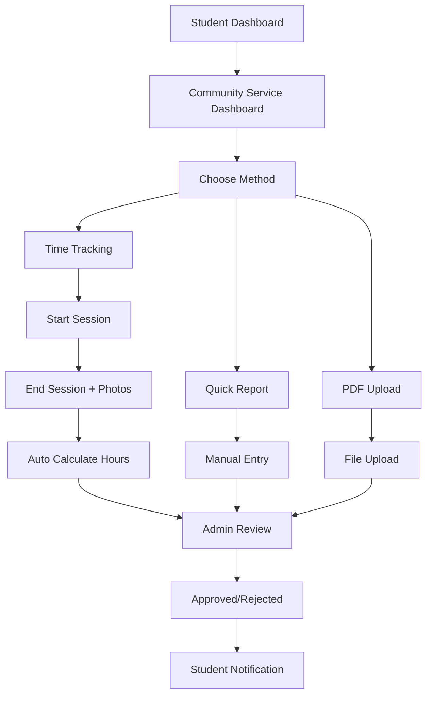

# Enhanced Community Service Implementation

## Overview

I've successfully implemented a comprehensive Community Service tracking system for the DSMS Scholar platform with the following key features:

### 🚀 Core Features

#### 1. **Dual Reporting System**
- **Time Tracking Mode**: Real-time tracking with clock-in/clock-out functionality
- **PDF Upload Mode**: Direct upload of complete service reports

#### 2. **Advanced Time Tracking**
- ⏰ Start and end time recording
- 📅 Service date tracking
- 📝 Task description logging
- 🧠 Lessons learned documentation
- 📸 Photo uploads (up to 5 photos per session)
- 🔢 Automatic hour calculation

#### 3. **Student-Friendly Interface**
- 📊 Visual progress tracking with animated progress bars
- 🎯 Multiple input options (tracking, quick report, PDF upload)
- 📱 Responsive design with modern UI components
- 🚨 Real-time alerts for active sessions
- 🎨 Color-coded status indicators

### 🛠 Technical Implementation

#### Database Schema
```sql
-- New table for detailed time tracking
CREATE TABLE community_service_entries (
    id BIGINT PRIMARY KEY,
    scholarship_application_id BIGINT,
    service_date DATE,
    time_in TIME,
    time_out TIME NULL,
    task_description TEXT,
    lessons_learned TEXT NULL,
    photos JSON NULL,
    hours_completed DECIMAL(4,2),
    status ENUM('in_progress', 'completed', 'approved', 'rejected'),
    admin_notes TEXT NULL,
    created_at TIMESTAMP,
    updated_at TIMESTAMP
);

-- Enhanced community service reports
ALTER TABLE community_service_reports ADD (
    pdf_report_path VARCHAR(255) NULL,
    report_type ENUM('tracked', 'pdf_upload') DEFAULT 'tracked',
    total_hours DECIMAL(6,2) DEFAULT 0
);
```

#### Backend Controllers

**CommunityServiceController** features:
- ✅ `create()` - Main dashboard with all tracking features
- ✅ `store()` - Handle both PDF uploads and tracked reports
- ✅ `startEntry()` - Begin time tracking session
- ✅ `endEntry()` - Complete session with photos and lessons
- ✅ `show()` - View individual reports
- ✅ `showEntry()` - View detailed time entries
- ✅ `downloadPdf()` - Secure PDF downloads
- ✅ `downloadPhoto()` - Secure photo downloads

#### Frontend Components

**Dashboard.tsx** - Main interface with 4 tabs:
1. **Overview**: Recent entries and reports summary
2. **Time Tracking**: Start/end sessions with real-time tracking
3. **Quick Report**: Manual entry for completed services
4. **PDF Upload**: Direct report file upload

**EntryShow.tsx** - Detailed view of individual time entries

### 🎨 UI/UX Features

#### Visual Design Elements
- 🌈 Gradient progress bars and headers
- 🎯 Tab-based navigation for easy switching
- 📊 Statistics cards with colored metrics
- 🚨 Active session alerts
- 📱 Fully responsive layout
- 🎨 Modern shadcn/ui components

#### User Experience
- **Simplified Process**: Clear workflow for different reporting methods
- **Visual Feedback**: Progress indicators and status badges
- **Smart Validation**: Prevents overlapping sessions and invalid data
- **File Management**: Secure uploads with proper validation
- **Accessibility**: Proper labeling and keyboard navigation

### 📱 Component Structure

```
Student/CommunityService/
├── Dashboard.tsx           # Main tracking interface
├── Create.tsx             # Legacy wrapper (redirects to Dashboard)
├── EntryShow.tsx          # Individual entry details
├── Show.tsx              # Report details view
└── NotEligible.tsx       # Access restriction view
```

### 🔗 API Endpoints

```php
// Main routes
GET  /student/applications/{app}/community-service
POST /student/applications/{app}/community-service

// Time tracking
POST  /student/applications/{app}/community-service/start-entry
PATCH /student/applications/{app}/community-service/entries/{entry}/end

// File management
GET /student/applications/{app}/community-service/{report}/download-pdf
GET /student/applications/{app}/community-service/entries/{entry}/photos/{path}
```

### 🔐 Security Features

- **Authorization**: Strict user ownership checks
- **File Validation**: PDF and image file type restrictions
- **Secure Storage**: Private disk storage for uploaded files
- **Input Validation**: Comprehensive server-side validation
- **CSRF Protection**: Built-in Laravel protection

### 📊 Data Flow



### 🚀 Key Benefits

#### For Students
- **Flexibility**: Choose between detailed tracking or quick uploads
- **Real-time Tracking**: Accurate hour recording with automatic calculations
- **Rich Documentation**: Add photos and learning reflections
- **Progress Visibility**: Clear view of completion status
- **Mobile Friendly**: Works seamlessly on all devices

#### For Administrators
- **Detailed Records**: Complete audit trail of all activities
- **Photo Evidence**: Visual verification of service activities
- **Structured Data**: Consistent formatting for easy review
- **Flexible Approval**: Handle both tracked and uploaded reports

#### For System
- **Scalability**: Efficient database design for large volumes
- **Performance**: Optimized queries and file handling
- **Maintainability**: Clean, modular code structure
- **Security**: Comprehensive protection measures

### 🎯 Next Steps

The system is ready for production use. Future enhancements could include:

1. **Mobile App**: Native mobile application for easier tracking
2. **GPS Integration**: Location verification for service activities
3. **Real-time Notifications**: Push notifications for session reminders
4. **Analytics Dashboard**: Detailed reports and insights
5. **Integration**: Connect with external volunteer platforms

### 🔧 Technical Notes

- Built with **Laravel 11** and **React 18**
- Uses **Inertia.js** for seamless SPA experience
- **TypeScript** for type safety
- **Tailwind CSS** with **shadcn/ui** components
- **File storage** on private disk with secure access
- **Database migrations** included for easy deployment

## 🛡️ **Admin Management System**

### ✨ **Admin Features Implemented:**

#### 1. **Comprehensive Dashboard**
- Real-time statistics for all community service submissions
- Visual progress tracking across all students
- Filter and search capabilities
- Export functionality for reporting

#### 2. **Dual Review System**
- **Report Management**: Review PDF uploads and tracked reports
- **Entry Management**: Review individual time tracking sessions
- Bulk approval/rejection with reasons
- Detailed review workflows

#### 3. **Advanced Review Interface**
- Photo gallery viewing for service documentation
- Time tracking verification with automatic calculations
- Student profile integration
- Status change tracking with admin notes

#### 4. **Admin Navigation Integration**
- Separated admin and student navigation systems
- Community Service section in admin sidebar
- Easy access to both reports and individual entries
- Breadcrumb navigation for context

### 📊 **Admin Components Structure**

```
Admin/CommunityService/
├── Index.tsx              # Main dashboard with statistics
├── Show.tsx              # Detailed report review interface  
├── Entries.tsx           # Time tracking entries management
└── EntryShow.tsx         # Individual entry detailed view
```

### 🎯 **Admin Routes**

```php
// Main management routes
GET  /admin/community-service                    # Dashboard
GET  /admin/community-service/entries           # Time entries index

// Detailed review routes  
GET  /admin/community-service/reports/{report}  # Report details
GET  /admin/community-service/entries/{entry}   # Entry details

// Action routes
PATCH /admin/community-service/reports/{report}/status  # Update report
PATCH /admin/community-service/entries/{entry}/status   # Update entry
POST  /admin/community-service/reports/bulk-update      # Bulk actions

// File access routes
GET /admin/community-service/reports/{report}/download-pdf
GET /admin/community-service/entries/{entry}/photos/{path}
GET /admin/community-service/export                     # CSV export
```

### 🎨 **Admin UI Highlights**

- **Statistics Cards**: Real-time overview of submission status
- **Advanced Filtering**: Status, type, and text-based search
- **Bulk Operations**: Approve/reject multiple submissions
- **Photo Gallery**: View service documentation images
- **Quick Actions**: One-click approve/reject with preset reasons
- **Export Functionality**: CSV download with all submission data
- **Responsive Design**: Works perfectly on all devices

### 🔒 **Security & Authorization**

- **Role-based Access**: Strict admin-only access controls
- **File Security**: Private disk storage with authenticated downloads
- **Input Validation**: Comprehensive server-side validation
- **Audit Trail**: Complete tracking of admin actions and decisions

The implementation provides a complete, professional-grade community service management system that handles both student submissions and administrative oversight with intuitive interfaces and robust security measures.