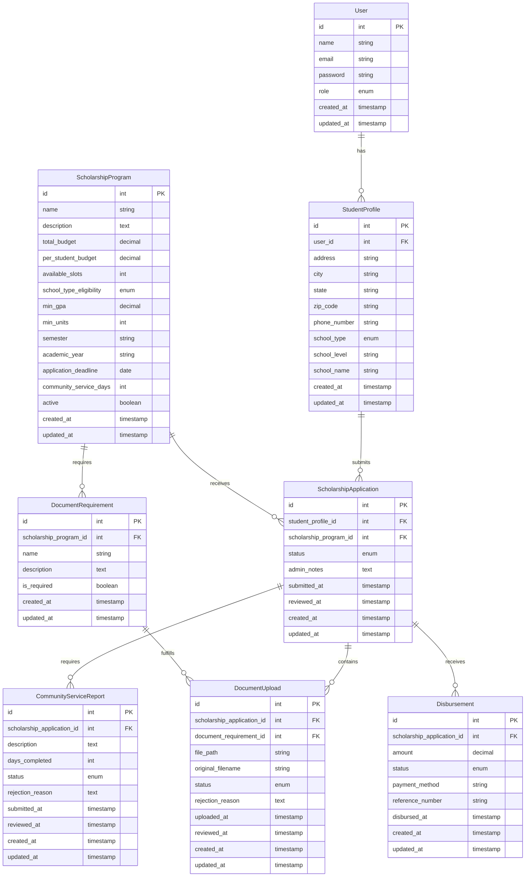

# Scholarship Management System Database Design

## Entity Relationship Diagram



## Models and Migrations

### User Model

```php
// Migration
Schema::create('users', function (Blueprint $table) {
    $table->id();
    $table->string('name');
    $table->string('email')->unique();
    $table->timestamp('email_verified_at')->nullable();
    $table->string('password');
    $table->enum('role', ['admin', 'student'])->default('student');
    $table->rememberToken();
    $table->timestamps();
});

// Model (app/Models/User.php)
class User extends Authenticatable
{
    use HasApiTokens, HasFactory, Notifiable;

    protected $fillable = [
        'name',
        'email',
        'password',
        'role',
    ];

    protected $hidden = [
        'password',
        'remember_token',
    ];

    protected $casts = [
        'email_verified_at' => 'datetime',
        'password' => 'hashed',
    ];

    public function studentProfile()
    {
        return $this->hasOne(StudentProfile::class);
    }
}
```

### StudentProfile Model

```php
// Migration
Schema::create('student_profiles', function (Blueprint $table) {
    $table->id();
    $table->foreignId('user_id')->constrained()->cascadeOnDelete();
    $table->string('address');
    $table->string('city');
    $table->string('state');
    $table->string('zip_code');
    $table->string('phone_number');
    $table->enum('school_type', ['high_school', 'college']);
    $table->string('school_level'); // Grade level for HS, Year level for college
    $table->string('school_name');
    $table->timestamps();
});

// Model (app/Models/StudentProfile.php)
class StudentProfile extends Model
{
    use HasFactory;

    protected $fillable = [
        'user_id',
        'address',
        'city',
        'state',
        'zip_code',
        'phone_number',
        'school_type',
        'school_level',
        'school_name',
    ];

    protected $casts = [
        'school_type' => 'string',
    ];

    public function user()
    {
        return $this->belongsTo(User::class);
    }

    public function scholarshipApplications()
    {
        return $this->hasMany(ScholarshipApplication::class);
    }
}
```

### ScholarshipProgram Model

```php
// Migration
Schema::create('scholarship_programs', function (Blueprint $table) {
    $table->id();
    $table->string('name');
    $table->text('description');
    $table->decimal('total_budget', 12, 2);
    $table->decimal('per_student_budget', 8, 2);
    $table->integer('available_slots')->storedAs('FLOOR(total_budget / per_student_budget)');
    $table->enum('school_type_eligibility', ['high_school', 'college', 'both']);
    $table->decimal('min_gpa', 5, 2);
    $table->integer('min_units')->nullable(); // Only applicable for college
    $table->string('semester');
    $table->string('academic_year');
    $table->date('application_deadline');
    $table->integer('community_service_days')->default(6);
    $table->boolean('active')->default(true);
    $table->timestamps();
});

// Model (app/Models/ScholarshipProgram.php)
class ScholarshipProgram extends Model
{
    use HasFactory;

    protected $fillable = [
        'name',
        'description',
        'total_budget',
        'per_student_budget',
        'school_type_eligibility',
        'min_gpa',
        'min_units',
        'semester',
        'academic_year',
        'application_deadline',
        'community_service_days',
        'active',
    ];

    protected $casts = [
        'total_budget' => 'decimal:2',
        'per_student_budget' => 'decimal:2',
        'min_gpa' => 'decimal:2',
        'application_deadline' => 'date',
        'active' => 'boolean',
    ];

    public function scholarshipApplications()
    {
        return $this->hasMany(ScholarshipApplication::class);
    }

    public function documentRequirements()
    {
        return $this->hasMany(DocumentRequirement::class);
    }
    
    public function getRemainingSlots()
    {
        $usedSlots = $this->scholarshipApplications()
            ->whereIn('status', ['approved', 'enrolled'])
            ->count();
        return $this->available_slots - $usedSlots;
    }
}
```

### ScholarshipApplication Model

```php
// Migration
Schema::create('scholarship_applications', function (Blueprint $table) {
    $table->id();
    $table->foreignId('student_profile_id')->constrained()->cascadeOnDelete();
    $table->foreignId('scholarship_program_id')->constrained()->cascadeOnDelete();
    $table->enum('status', [
        'draft', 
        'submitted', 
        'documents_pending', 
        'documents_under_review',
        'documents_approved',
        'documents_rejected',
        'eligibility_verified',
        'enrolled',
        'service_pending',
        'service_completed',
        'disbursement_pending',
        'disbursement_processed',
        'completed',
        'rejected'
    ])->default('draft');
    $table->text('admin_notes')->nullable();
    $table->timestamp('submitted_at')->nullable();
    $table->timestamp('reviewed_at')->nullable();
    $table->timestamps();
});

// Model (app/Models/ScholarshipApplication.php)
class ScholarshipApplication extends Model
{
    use HasFactory;

    protected $fillable = [
        'student_profile_id',
        'scholarship_program_id',
        'status',
        'admin_notes',
        'submitted_at',
        'reviewed_at',
    ];

    protected $casts = [
        'submitted_at' => 'datetime',
        'reviewed_at' => 'datetime',
    ];

    public function studentProfile()
    {
        return $this->belongsTo(StudentProfile::class);
    }

    public function scholarshipProgram()
    {
        return $this->belongsTo(ScholarshipProgram::class);
    }

    public function documentUploads()
    {
        return $this->hasMany(DocumentUpload::class);
    }

    public function communityServiceReports()
    {
        return $this->hasMany(CommunityServiceReport::class);
    }

    public function disbursements()
    {
        return $this->hasMany(Disbursement::class);
    }
}
```

### DocumentRequirement Model

```php
// Migration
Schema::create('document_requirements', function (Blueprint $table) {
    $table->id();
    $table->foreignId('scholarship_program_id')->constrained()->cascadeOnDelete();
    $table->string('name');
    $table->text('description');
    $table->boolean('is_required')->default(true);
    $table->timestamps();
});

// Model (app/Models/DocumentRequirement.php)
class DocumentRequirement extends Model
{
    use HasFactory;

    protected $fillable = [
        'scholarship_program_id',
        'name',
        'description',
        'is_required',
    ];

    protected $casts = [
        'is_required' => 'boolean',
    ];

    public function scholarshipProgram()
    {
        return $this->belongsTo(ScholarshipProgram::class);
    }

    public function documentUploads()
    {
        return $this->hasMany(DocumentUpload::class);
    }
}
```

### DocumentUpload Model

```php
// Migration
Schema::create('document_uploads', function (Blueprint $table) {
    $table->id();
    $table->foreignId('scholarship_application_id')->constrained()->cascadeOnDelete();
    $table->foreignId('document_requirement_id')->constrained()->cascadeOnDelete();
    $table->string('file_path');
    $table->string('original_filename');
    $table->enum('status', [
        'pending_review', 
        'approved', 
        'rejected_invalid', 
        'rejected_incomplete', 
        'rejected_incorrect_format',
        'rejected_unreadable',
        'rejected_other'
    ])->default('pending_review');
    $table->text('rejection_reason')->nullable();
    $table->timestamp('uploaded_at');
    $table->timestamp('reviewed_at')->nullable();
    $table->timestamps();
});

// Model (app/Models/DocumentUpload.php)
class DocumentUpload extends Model
{
    use HasFactory;

    protected $fillable = [
        'scholarship_application_id',
        'document_requirement_id',
        'file_path',
        'original_filename',
        'status',
        'rejection_reason',
        'uploaded_at',
        'reviewed_at',
    ];

    protected $casts = [
        'uploaded_at' => 'datetime',
        'reviewed_at' => 'datetime',
    ];

    public function scholarshipApplication()
    {
        return $this->belongsTo(ScholarshipApplication::class);
    }

    public function documentRequirement()
    {
        return $this->belongsTo(DocumentRequirement::class);
    }
}
```

### CommunityServiceReport Model

```php
// Migration
Schema::create('community_service_reports', function (Blueprint $table) {
    $table->id();
    $table->foreignId('scholarship_application_id')->constrained()->cascadeOnDelete();
    $table->text('description');
    $table->integer('days_completed');
    $table->enum('status', [
        'pending_review', 
        'approved', 
        'rejected_insufficient_hours', 
        'rejected_incomplete_documentation',
        'rejected_other'
    ])->default('pending_review');
    $table->text('rejection_reason')->nullable();
    $table->timestamp('submitted_at');
    $table->timestamp('reviewed_at')->nullable();
    $table->timestamps();
});

// Model (app/Models/CommunityServiceReport.php)
class CommunityServiceReport extends Model
{
    use HasFactory;

    protected $fillable = [
        'scholarship_application_id',
        'description',
        'days_completed',
        'status',
        'rejection_reason',
        'submitted_at',
        'reviewed_at',
    ];

    protected $casts = [
        'submitted_at' => 'datetime',
        'reviewed_at' => 'datetime',
    ];

    public function scholarshipApplication()
    {
        return $this->belongsTo(ScholarshipApplication::class);
    }
}
```

### Disbursement Model

```php
// Migration
Schema::create('disbursements', function (Blueprint $table) {
    $table->id();
    $table->foreignId('scholarship_application_id')->constrained()->cascadeOnDelete();
    $table->decimal('amount', 8, 2);
    $table->enum('status', [
        'pending', 
        'processing', 
        'disbursed', 
        'on_hold',
        'cancelled'
    ])->default('pending');
    $table->string('payment_method')->nullable();
    $table->string('reference_number')->nullable();
    $table->timestamp('disbursed_at')->nullable();
    $table->timestamps();
});

// Model (app/Models/Disbursement.php)
class Disbursement extends Model
{
    use HasFactory;

    protected $fillable = [
        'scholarship_application_id',
        'amount',
        'status',
        'payment_method',
        'reference_number',
        'disbursed_at',
    ];

    protected $casts = [
        'amount' => 'decimal:2',
        'disbursed_at' => 'datetime',
    ];

    public function scholarshipApplication()
    {
        return $this->belongsTo(ScholarshipApplication::class);
    }
}
```

## Key Features Implementation

### Automatic Slot Calculation

The `available_slots` in the `scholarship_programs` table is implemented as a computed column:
```php
$table->integer('available_slots')->storedAs('FLOOR(total_budget / per_student_budget)');
```

### Application Workflow

The application goes through several status changes:
1. Student submits application (`draft` -> `submitted`)  
2. Student uploads required documents (`submitted` -> `documents_pending` -> `documents_under_review`)  
3. Admin reviews documents (`documents_under_review` -> `documents_approved` or `documents_rejected`)  
4. Admin verifies eligibility (GPA ≥ minimum, units ≥ 15 for college) (`documents_approved` -> `eligibility_verified`)  
5. Student is enrolled in program (`eligibility_verified` -> `enrolled`)  
6. Student submits community service reports (`enrolled` -> `service_pending` -> `service_completed`)  
7. Admin processes disbursement (`service_completed` -> `disbursement_pending` -> `disbursement_processed` -> `completed`)  

### Status Enumerations

Document Upload Status:
- `pending_review`: Initial state
- `approved`: Document accepted
- `rejected_invalid`: Document invalid
- `rejected_incomplete`: Document incomplete
- `rejected_incorrect_format`: Wrong file format
- `rejected_unreadable`: Document not legible
- `rejected_other`: Other reasons

Community Service Report Status:
- `pending_review`: Initial state
- `approved`: Report accepted
- `rejected_insufficient_hours`: Not enough service hours
- `rejected_incomplete_documentation`: Missing information
- `rejected_other`: Other reasons

Disbursement Status:
- `pending`: Initial state
- `processing`: Cheque being prepared
- `disbursed`: Money sent to student
- `on_hold`: Temporarily paused
- `cancelled`: Cancelled disbursement

## Database Seeders

Create seeders for:
1. User roles (admin, student)
2. Sample scholarship programs with requirements
3. Document requirement types

## Next Steps

1. Create controllers for each model
2. Implement authentication and authorization
3. Build forms for student application and document uploads
4. Create admin dashboard for reviewing applications
5. Implement notification system for status changes