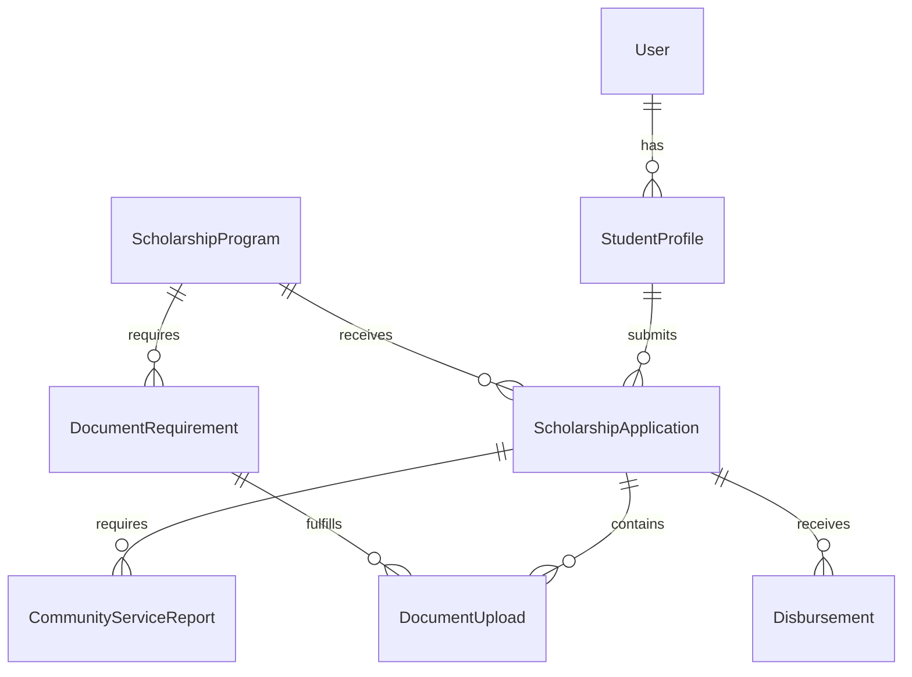

# Database Schema

## Entity Relationship Diagram (ERD)

## Key Tables

### 1. `users`
-   **Role**: `admin` or `student`.
-   **Authentication**: Standard Laravel email/password.

### 2. `student_profiles`
-   **Link**: `user_id` (One-to-One).
-   **Data**: Address, School Type (`high_school`, `college`), School Name.
-   **Usage**: Used for filtering eligible scholarships.

### 3. `scholarship_programs`
-   **Budgeting**:
    -   `total_budget`: Total money available.
    -   `per_student_budget`: Cost per student.
    -   `available_slots`: **Computed Column** (`FLOOR(total_budget / per_student_budget)`).
-   **Rules**: `min_gpa`, `school_type_eligibility`.

### 4. `scholarship_applications`
-   **The Core Pivot**: Connects a `StudentProfile` to a `ScholarshipProgram`.
-   **State**: Tracks the status (e.g., `documents_pending`, `enrolled`).
-   **Timestamps**: `submitted_at`, `reviewed_at`.

### 5. `document_uploads`
-   **Link**: Application -> Document Requirement.
-   **File**: Path to the stored file.
-   **Status**: `pending_review`, `approved`, `rejected_*`.
-   **Feedback**: `rejection_reason` is shown to the student.

### 6. `community_service_entries` & `reports`
-   **Entries**: Detailed granular logs (Date, Time In, Time Out, Description).
-   **Reports**: High-level summaries or PDF uploads.
-   **Evidence**: Can contain JSON paths to uploaded photos.

### 7. `disbursements`
-   **Link**: Application -> Disbursement.
-   **Financials**: Amount, Payment Method, Reference Number.
