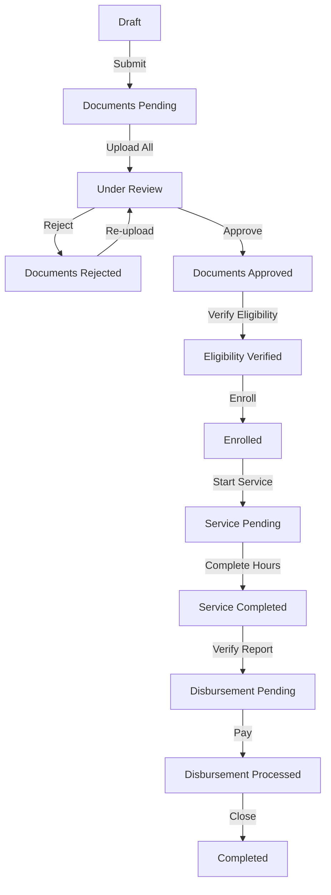

# Workflow & State Machine

The heart of the application is the **ScholarshipApplication** state machine. This ensures data integrity and a correct process flow.

## The States

The `status` column in `scholarship_applications` table can have the following values:

### 1. Application Phase
-   `draft`: Student is filling out the form. Not visible to admins.
-   `submitted`: Student finalized the form.
-   `documents_pending`: System detected missing required documents.

### 2. Verification Phase
-   `documents_under_review`: Student uploaded all files. Admin can now review.
-   `documents_rejected`: Admin rejected one or more files. Workflow loops back to student upload.
-   `documents_approved`: All files are valid.

### 3. Approval Phase
-   `eligibility_verified`: Admin (or System) confirmed GPA/Units.
-   `enrolled`: **Critical Milestone**. Student consumes a slot in the program.

### 4. Maintenance Phase
-   `service_pending`: Student must complete community service hours.
-   `service_completed`: Student finished requirements. Admin must verify.

### 5. Disbursement Phase
-   `disbursement_pending`: Approved for payout.
-   `disbursement_processed`: Payment sent.
-   `completed`: Cycle finished.

## Logic Flow



## Automatic Slot Calculation

In the `ScholarshipProgram` model/table:
-   **Field**: `available_slots`
-   **Logic**: It is a generated column in the database (or calculated on save).
-   **Formula**: `FLOOR(total_budget / per_student_budget)`
-   **Usage**: When enrolling a student, we check:
    ```php
    $enrolledCount = Application::where('status', 'enrolled')->count();
    if ($enrolledCount >= $program->available_slots) {
        throw new Exception("Program Full");
    }
    ```
